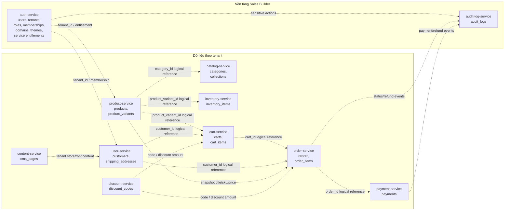
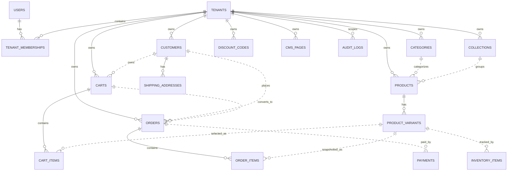
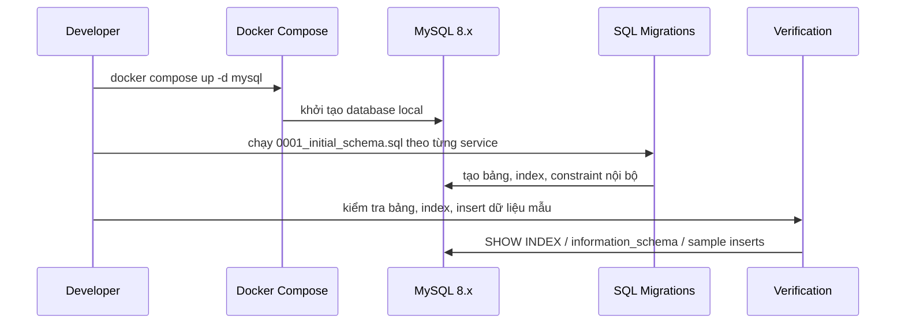

# Flow 4: Thiết Kế Database Schema MySQL Theo Service

## Tóm Tắt

Flow 4 thiết kế nền tảng database MySQL cho MVP bán hàng của Sales Builder. Schema cần bám theo kết quả flow 3: hệ thống là SaaS multi-tenant, có phân biệt platform user, tenant user, customer, service entitlement và audit boundary.

Hướng thực hiện chính:

- Tách schema theo service ownership thay vì gom tất cả vào một database đơn lẻ.
- Dùng SQL migrations thuần cho MySQL.
- Mỗi service chỉ sở hữu và ghi dữ liệu của mình.
- Không tạo foreign key xuyên database/service; relationship xuyên service dùng `tenant_id`, logical ID và snapshot dữ liệu quan trọng.
- Chuyển local database từ PostgreSQL sang MySQL để mọi máy local tạo database giống nhau.
- Không xoá cứng dữ liệu ngay khi người dùng/admin bấm xoá. Flow 4 phải chuẩn bị soft delete và retention metadata để dữ liệu không mất tức thì.
- Cleanup dữ liệu rác hoặc xoá vật lý sau thời gian giữ dữ liệu sẽ là job riêng ở flow tương lai, mặc định giữ 30 ngày nếu từng tính năng không cấu hình khác.

## Checklist Implement Flow 4

- [x] Cập nhật `infra/local/docker-compose.yml` sang MySQL 8.x.
- [x] Cập nhật `DATABASE_URL` trong các `.env.example` liên quan sang dạng `mysql://...`.
- [x] Cập nhật Prisma datasource provider hiện có sang `mysql`.
- [x] Tạo thư mục `database/migrations` cho các service cần schema.
- [x] Tạo `0001_initial_schema.sql` cho `auth-service`.
- [x] Tạo `0001_initial_schema.sql` cho `user-service`.
- [x] Tạo `0001_initial_schema.sql` cho `product-service`.
- [x] Tạo `0001_initial_schema.sql` cho `catalog-service`.
- [x] Tạo `0001_initial_schema.sql` cho `inventory-service`.
- [x] Tạo `0001_initial_schema.sql` cho `cart-service`.
- [x] Tạo `0001_initial_schema.sql` cho `order-service`.
- [x] Tạo `0001_initial_schema.sql` cho `payment-service`.
- [x] Tạo `0001_initial_schema.sql` cho `discount-service`.
- [x] Tạo `0001_initial_schema.sql` cho `content-service`.
- [x] Tạo `0001_initial_schema.sql` cho `audit-log-service`.
- [x] Thêm đầy đủ index tìm kiếm: product title, slug, sku, category id, order number, customer id.
- [x] Thêm soft delete/retention metadata cho bảng có thể xoá từ UI/API.
- [x] Đảm bảo `orders`, `order_items`, `payments`, `audit_logs` không bị xoá vật lý trong MVP.
- [x] Chạy migration trên database MySQL sạch.
- [x] Kiểm tra bảng, index, unique constraint và foreign key nội bộ.
- [x] Kiểm tra retention mặc định `delete_after = delete_requested_at + 30 ngày`.
- [x] Chạy typecheck sau khi cập nhật cấu hình DB.

## Sơ Đồ Tổng Quan

## Sơ Đồ Quan Hệ Dữ Liệu Cốt Lõi

Ghi chú cho sơ đồ:

- Đường quan hệ `||--` là foreign key nội bộ trong cùng service hoặc cùng database sở hữu.
- Đường quan hệ `||..` là logical reference xuyên service, không tạo foreign key vật lý.
- `order_items` phải lưu snapshot sản phẩm, SKU và giá tại thời điểm đặt hàng.

## Thay Đổi Chính

- Thêm tài liệu database chi tiết trong [docs/database](./README.md), bao gồm mục đích từng bảng và công dụng từng field.
- Cập nhật `infra/local/docker-compose.yml` để thay PostgreSQL bằng MySQL 8.x.
- Cập nhật các `.env.example` liên quan để `DATABASE_URL` dùng dạng `mysql://...`.
- Cập nhật Prisma datasource provider hiện có sang `mysql` để cấu hình repo không lệch với DB mới, dù migration chính thức của flow này là SQL.
- Thêm migration SQL đầu tiên theo quy ước:
  - `services/auth-service/database/migrations/0001_initial_schema.sql`
  - `services/user-service/database/migrations/0001_initial_schema.sql`
  - `services/product-service/database/migrations/0001_initial_schema.sql`
  - `services/catalog-service/database/migrations/0001_initial_schema.sql`
  - `services/cart-service/database/migrations/0001_initial_schema.sql`
  - `services/order-service/database/migrations/0001_initial_schema.sql`
  - `services/inventory-service/database/migrations/0001_initial_schema.sql`
  - `services/payment-service/database/migrations/0001_initial_schema.sql`
  - `services/discount-service/database/migrations/0001_initial_schema.sql`
  - `services/content-service/database/migrations/0001_initial_schema.sql`
  - `services/audit-log-service/database/migrations/0001_initial_schema.sql`
- Nếu service folder chưa tồn tại, chỉ tạo phần `database/migrations` tối thiểu trong flow này. Không scaffold API/domain/repository ngoài phạm vi database schema.
- Thêm quy ước soft delete/retention cho bảng có dữ liệu quản trị hoặc dữ liệu người dùng: `deleted_at`, `delete_requested_at`, `delete_after`, `deleted_by_user_id`, `delete_reason`.
- Không viết migration hoặc logic nào xoá vật lý dữ liệu business ngay trong flow 4.

## Kế Hoạch Schema

### Auth Service

Sở hữu các bảng liên quan đến danh tính đăng nhập, platform role và tenant membership:

- `users`
- `platform_user_roles`
- `tenants`
- `tenant_memberships`
- `tenant_member_roles`
- `tenant_domains`
- `tenant_themes`
- `tenant_service_entitlements`

Ghi chú:

- `guest` không lưu như role trong database user.
- User có thể có nhiều membership ở nhiều tenant.
- Tenant/domain/theme/entitlement cần có sớm vì flow 3 yêu cầu permission luôn được check theo `tenantId` và service đã kích hoạt.

### User Service

Sở hữu dữ liệu hồ sơ khách hàng và địa chỉ:

- `customers`
- `shipping_addresses`

Ghi chú:

- `customers` phải có `tenant_id`.
- Cùng một email có thể là customer ở nhiều tenant khác nhau.
- `shipping_addresses` liên kết nội bộ với `customers`.

### Product Service

Sở hữu dữ liệu sản phẩm và biến thể:

- `products`
- `product_variants`

Ghi chú:

- `products` có `tenant_id`, `title`, `slug`, `status`, `category_id` logical reference, timestamps và soft delete.
- `product_variants` có `tenant_id`, `product_id`, `sku`, giá, trạng thái và option/attributes dạng JSON nếu cần mở rộng.
- Nếu cần ảnh sản phẩm trong MVP nhưng chưa có file-storage-service, cho phép trường `image_url` hoặc JSON media metadata tối thiểu.

### Catalog Service

Sở hữu cấu trúc điều hướng catalog:

- `categories`
- `collections`
- `collection_products`

Ghi chú:

- `categories` và `collections` có `tenant_id`, `slug`, `title`, `status`.
- `collection_products` dùng logical reference đến product nếu product-service tách database.

### Inventory Service

Sở hữu tồn kho:

- `inventory_items`

Ghi chú:

- Lưu tồn kho theo `tenant_id` và `product_variant_id`.
- `product_variant_id` là logical reference nếu inventory-service tách database riêng.
- Dùng `DECIMAL(15, 2)` cho quantity nếu sau này có sản phẩm cần đơn vị lẻ; nếu MVP chỉ bán hàng cái, có thể dùng `INT UNSIGNED`.

### Cart Service

Sở hữu giỏ hàng:

- `carts`
- `cart_items`

Ghi chú:

- `carts` hỗ trợ cả guest và customer bằng `session_id` và optional `customer_id`.
- `cart_items` lưu `product_variant_id`, quantity và snapshot giá hiện tại nếu cần hiển thị nhanh.
- Cart có status như `active`, `completed`, `abandoned`.

### Order Service

Sở hữu đơn hàng và item snapshot:

- `orders`
- `order_items`

Ghi chú:

- `orders` có `tenant_id`, `customer_id`, optional `cart_id`, `order_number`, status và các tổng tiền.
- `order_items` bắt buộc lưu snapshot: product title, variant title, sku, unit price, quantity, subtotal.
- Không phụ thuộc vào product-service để đọc lại giá/tên sản phẩm lịch sử.

### Payment Service

Sở hữu thanh toán:

- `payments`

Ghi chú:

- `payments` có `tenant_id`, logical `order_id`, provider, method, amount, currency, status và transaction reference.
- Refund chỉ cần nền tảng schema; logic refund làm ở flow sau.

### Discount Service

Sở hữu mã giảm giá:

- `discount_codes`

Ghi chú:

- Hỗ trợ discount theo amount hoặc percent.
- Có `starts_at`, `ends_at`, `usage_limit`, `used_count`, status.
- Có `tenant_id` để mỗi tenant có namespace mã giảm giá riêng.

### Content Service

Sở hữu CMS page:

- `cms_pages`

Ghi chú:

- Có `tenant_id`, `slug`, `title`, `content`, `status`, SEO metadata cơ bản.
- `slug` unique theo tenant.

### Audit Log Service

Sở hữu audit log:

- `audit_logs`

Ghi chú:

- Có `tenant_id` nullable để ghi được cả platform-level event.
- Có actor fields: `actor_id`, `actor_type`, `actor_role`.
- Có action/resource fields: `action`, `resource_type`, `resource_id`.
- Có `metadata` JSON, `ip_address`, `user_agent`, `created_at`.
- Dùng cho các thao tác nhạy cảm từ flow 3: đổi gói dịch vụ, impersonation, refund, đổi owner, domain/theme.

## Chuẩn MySQL

- Dùng `BIGINT UNSIGNED AUTO_INCREMENT` cho primary key.
- Dùng `tenant_id BIGINT UNSIGNED NOT NULL` trên mọi bảng tenant-owned.
- Dùng `DATETIME` UTC cho `created_at`, `updated_at`, optional `deleted_at`.
- Với bảng có thể xoá từ UI/API, dùng thêm `delete_requested_at`, `delete_after`, `deleted_by_user_id`, `delete_reason` để chuẩn bị cleanup an toàn.
- `deleted_at` chỉ có nghĩa là bản ghi bị ẩn/không còn active trong nghiệp vụ; không đồng nghĩa dữ liệu đã bị xoá vật lý.
- Dùng `DECIMAL(15, 2)` cho money, không dùng `FLOAT` hoặc `DOUBLE`.
- Dùng `VARCHAR` status thay vì `ENUM` để dễ mở rộng.
- Dùng `JSON` cho extension data, không dùng JSON cho trường cần filter/constraint thường xuyên.
- Mỗi bảng dùng `ENGINE=InnoDB DEFAULT CHARSET=utf8mb4 COLLATE=utf8mb4_unicode_ci`.
- Foreign key nội bộ trong cùng service phải có index. Logical foreign key xuyên service cũng phải có index.

## Quan Hệ Và Index

Relationship nội bộ nên có foreign key:

- `product_variants.product_id -> products.id`
- `shipping_addresses.customer_id -> customers.id`
- `cart_items.cart_id -> carts.id`
- `order_items.order_id -> orders.id`

Relationship xuyên service chỉ dùng logical reference:

- `products.category_id` tham chiếu logical đến `categories.id`.
- `collection_products.product_id` tham chiếu logical đến `products.id`.
- `inventory_items.product_variant_id` tham chiếu logical đến `product_variants.id`.
- `carts.customer_id` tham chiếu logical đến `customers.id`.
- `orders.customer_id` tham chiếu logical đến `customers.id`.
- `orders.cart_id` tham chiếu logical đến `carts.id`.
- `cart_items.product_variant_id` tham chiếu logical đến `product_variants.id`.
- `order_items.product_variant_id` tham chiếu logical đến `product_variants.id`.
- `payments.order_id` tham chiếu logical đến `orders.id`.

Index bắt buộc:

- `products(title)`
- `products(tenant_id, slug)` unique
- `product_variants(tenant_id, sku)` unique
- `products(tenant_id, category_id)`
- `orders(tenant_id, order_number)` unique
- `orders(tenant_id, customer_id, created_at)`
- `carts(tenant_id, customer_id, status)`
- `categories(tenant_id, slug)` unique
- `collections(tenant_id, slug)` unique
- `cms_pages(tenant_id, slug)` unique
- `discount_codes(tenant_id, code)` unique
- `audit_logs(tenant_id, created_at)`
- `audit_logs(actor_id, created_at)`
- Với bảng có soft delete, thêm index phù hợp cho cleanup job tương lai, thường là `(deleted_at, delete_after)` hoặc `(tenant_id, deleted_at, delete_after)`.

## Chính Sách Xoá Dữ Liệu Và Retention

- Không xoá cứng mặc định khi admin/customer thực hiện thao tác xoá. Service chỉ cập nhật status và các field soft delete.
- Bản ghi đã xoá mềm phải bị loại khỏi query mặc định bằng điều kiện `deleted_at IS NULL` hoặc status active tương ứng.
- Dữ liệu có liên quan đến lịch sử giao dịch, audit, thanh toán và đơn hàng không được xoá vật lý trong MVP. Nếu cần ẩn khỏi giao diện, chỉ dùng trạng thái huỷ/ẩn và vẫn giữ snapshot.
- Cleanup job trong tương lai được phép xoá vật lý dữ liệu rác sau khi `delete_after <= NOW()` và bản ghi không còn bị tham chiếu bởi nghiệp vụ quan trọng.
- Thời gian giữ dữ liệu mặc định là 30 ngày tính từ `delete_requested_at`; từng tính năng có thể cấu hình khác khi có yêu cầu pháp lý hoặc nghiệp vụ.
- Mọi lần xoá mềm và xoá vật lý sau này phải ghi `audit_logs` với actor, action, resource và lý do.

## Sơ Đồ Luồng Migration Local

## Kế Hoạch Kiểm Thử

- Chạy MySQL local bằng docker compose mới.
- Chạy toàn bộ migration SQL trên database sạch theo thứ tự service.
- Xác nhận các bảng core được tạo:
  - `users`
  - `customers`
  - `products`
  - `product_variants`
  - `categories`
  - `collections`
  - `inventory_items`
  - `carts`
  - `cart_items`
  - `orders`
  - `order_items`
  - `payments`
  - `shipping_addresses`
  - `discount_codes`
  - `cms_pages`
  - `audit_logs`
- Insert dữ liệu mẫu tối thiểu: tenant, customer, category, product, variant, inventory item, cart, order, payment, cms page, audit log.
- Kiểm tra unique constraint theo tenant:
  - hai tenant khác nhau có thể có cùng `slug`, `sku`, `order_number`.
  - cùng một tenant không được trùng `slug`, `sku`, `order_number`.
- Kiểm tra foreign key nội bộ cùng service hoạt động.
- Kiểm tra index bằng `SHOW INDEX FROM ...` hoặc `information_schema.statistics`.
- Kiểm tra thao tác xoá mềm không làm mất bản ghi vật lý: record vẫn tồn tại, có `deleted_at`, `delete_requested_at`, `delete_after`.
- Kiểm tra query mặc định không trả về bản ghi đã xoá mềm.
- Kiểm tra `delete_after` mặc định bằng `delete_requested_at + 30 ngày` nếu tính năng không chỉ định retention khác.
- Chạy `pnpm typecheck` để đảm bảo đổi datasource/env không làm hỏng repo hiện tại.

## Giả Định

- Target DB là MySQL 8.x, không tối ưu riêng cho MariaDB.
- Flow 4 chỉ tạo schema, migration và cấu hình local DB; chưa xây API CRUD, repository thật, seed data đầy đủ hoặc checkout logic.
- Vì đã chọn tách theo service, không tạo foreign key xuyên database/service.
- Service-layer sau này phải check tenant boundary và ownership cho mọi logical reference.
- Các service chưa tồn tại có thể được tạo thư mục migration tối thiểu trong flow này; scaffold service đầy đủ làm ở flow sau.
- Flow 4 chưa triển khai cleanup job xoá dữ liệu rác; chỉ chuẩn bị schema và nguyên tắc để flow tương lai triển khai an toàn.
