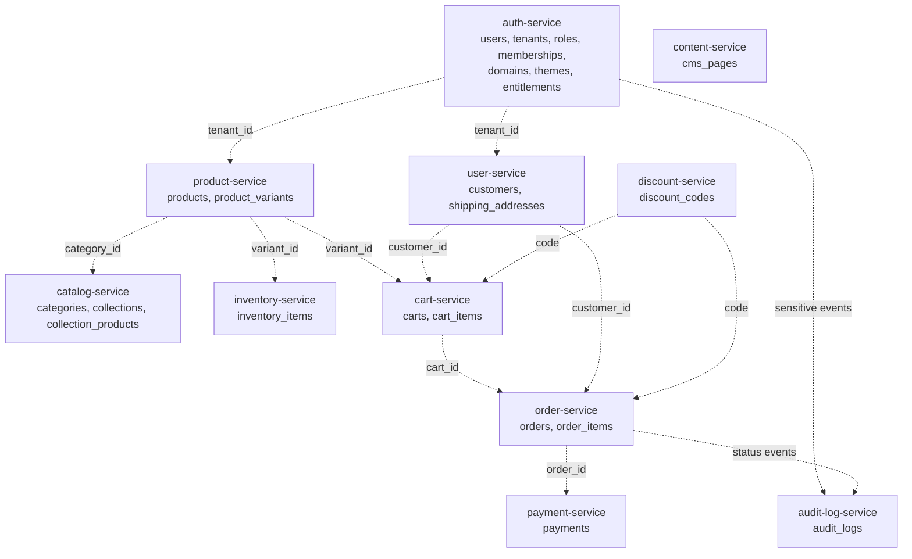

# Flow 4: Chi Tiết Database Tables

Tài liệu này mô tả chi tiết các bảng database nền tảng cho MVP bán hàng của Sales Builder. Nội dung bám theo flow 4 và kết quả flow 3: hệ thống dùng MySQL, tách schema theo service, hỗ trợ multi-tenant, role/permission theo tenant và audit boundary.

## Quy Ước Chung

- Primary key mặc định: `id BIGINT UNSIGNED AUTO_INCREMENT`.
- Timestamps mặc định: `created_at`, `updated_at`.
- Không xoá cứng dữ liệu ngay khi người dùng/admin bấm xoá. Mặc định dùng soft delete để tránh mất dữ liệu tức thì.
- Soft delete dùng `deleted_at DATETIME NULL` khi bảng có vòng đời quản trị.
- Bảng có thể bị xoá từ UI/API nên có thêm `delete_requested_at`, `delete_after`, `deleted_by_user_id`, `delete_reason` nếu dữ liệu cần được giữ lại trước khi cleanup.
- Thời gian giữ dữ liệu trước khi cleanup mặc định là 30 ngày tính từ `delete_requested_at`, trừ khi từng tính năng định nghĩa retention khác.
- Các bảng tenant-owned phải có `tenant_id BIGINT UNSIGNED NOT NULL`.
- Tiền tệ dùng `DECIMAL(15, 2)`.
- Status dùng `VARCHAR(32)` hoặc `VARCHAR(64)`, không dùng `ENUM` để dễ mở rộng.
- Field JSON chỉ dùng cho dữ liệu mở rộng, không dùng cho dữ liệu cần filter/index thường xuyên.
- Field có hậu tố `_id` trỏ sang service khác là logical reference nếu hai bảng không cùng service/database.

## Chính Sách Xoá Mềm Và Cleanup Tương Lai

Thao tác xoá trong ứng dụng không được chạy `DELETE` trực tiếp với dữ liệu business. Service phải đánh dấu bản ghi là đã xoá mềm, ẩn bản ghi khỏi query mặc định, và để cleanup job xử lý xoá vật lý trong tương lai nếu đủ điều kiện.

| Field | Kiểu dữ liệu gợi ý | Công dụng |
| --- | --- | --- |
| `deleted_at` | `DATETIME NULL` | Thời điểm bản ghi bị xoá mềm/ẩn khỏi nghiệp vụ chính. Dữ liệu vẫn còn trong database. |
| `delete_requested_at` | `DATETIME NULL` | Thời điểm người dùng/admin hoặc hệ thống yêu cầu xoá. Dùng để tính retention. |
| `delete_after` | `DATETIME NULL` | Thời điểm sớm nhất cleanup job được phép xoá vật lý. Mặc định là `delete_requested_at + 30 ngày` nếu tính năng không cấu hình khác. |
| `deleted_by_user_id` | `BIGINT UNSIGNED NULL` | Logical reference đến user đã yêu cầu xoá, dùng cho audit và khôi phục. |
| `delete_reason` | `VARCHAR(255) NULL` | Lý do xoá, ví dụ admin xoá thủ công, khách yêu cầu xoá, cart hết hạn, dữ liệu nháp bị dọn. |

Quy tắc áp dụng:

- Query mặc định phải loại bản ghi có `deleted_at IS NOT NULL`.
- Các bảng giao dịch như `orders`, `order_items`, `payments`, `audit_logs` không xoá vật lý trong MVP; chỉ dùng status để huỷ/ẩn khi cần.
- Cleanup job tương lai chỉ xoá vật lý khi `delete_after <= NOW()` và dữ liệu không còn cần cho order, payment, audit, báo cáo hoặc nghĩa vụ pháp lý.
- Mọi thao tác xoá mềm và xoá vật lý sau này phải ghi audit log.
- Index gợi ý cho bảng có retention: `(deleted_at, delete_after)` hoặc `(tenant_id, deleted_at, delete_after)`.

## Checklist Implement Theo Nhóm Bảng

### Auth Và Tenant

- [x] Tạo bảng `users`.
- [x] Tạo bảng `platform_user_roles`.
- [x] Tạo bảng `tenants`.
- [x] Tạo bảng `tenant_memberships`.
- [x] Tạo bảng `tenant_member_roles`.
- [x] Tạo bảng `tenant_domains`.
- [x] Tạo bảng `tenant_themes`.
- [x] Tạo bảng `tenant_service_entitlements`.
- [x] Thêm cơ chế thu hồi bằng `revoked_at`/`removed_at` thay vì xoá record role/membership.
- [x] Thêm soft delete/retention metadata cho `users`, `tenants`, `tenant_domains`, `tenant_themes`.

### Customer Và Address

- [x] Tạo bảng `customers`.
- [x] Tạo bảng `shipping_addresses`.
- [x] Thêm index tra cứu customer theo email/phone trong tenant.
- [x] Thêm soft delete/retention metadata cho customer và địa chỉ.

### Product Và Catalog

- [x] Tạo bảng `products`.
- [x] Tạo bảng `product_variants`.
- [x] Tạo bảng `categories`.
- [x] Tạo bảng `collections`.
- [x] Tạo bảng `collection_products`.
- [x] Thêm unique `(tenant_id, slug)` cho product/category/collection.
- [x] Thêm unique `(tenant_id, sku)` cho variant.
- [x] Thêm cơ chế gỡ mềm collection placement bằng `removed_at`.
- [x] Thêm soft delete/retention metadata cho product, variant, category, collection.

### Inventory

- [x] Tạo bảng `inventory_items`.
- [x] Thêm unique `(tenant_id, product_variant_id)`.
- [x] Thêm index tra cứu tồn kho theo sku.
- [x] Thêm soft delete/retention metadata cho inventory item.

### Cart

- [x] Tạo bảng `carts`.
- [x] Tạo bảng `cart_items`.
- [x] Hỗ trợ cart cho guest bằng `session_id`.
- [x] Hỗ trợ cart cho customer bằng `customer_id`.
- [x] Thêm unique `(cart_id, product_variant_id)`.
- [x] Thêm soft delete/retention metadata để dọn cart rác trong tương lai.

### Order

- [x] Tạo bảng `orders`.
- [x] Tạo bảng `order_items`.
- [x] Thêm unique `(tenant_id, order_number)`.
- [x] Lưu snapshot sản phẩm, SKU, giá và địa chỉ giao hàng.
- [x] Đảm bảo order/order item chỉ ẩn mềm hoặc đổi status, không xoá vật lý trong MVP.

### Payment Và Discount

- [x] Tạo bảng `payments`.
- [x] Tạo bảng `discount_codes`.
- [x] Thêm index tra cứu payment theo order.
- [x] Thêm unique `(tenant_id, code)` cho discount code.
- [x] Đảm bảo payment không xoá vật lý trong MVP.
- [x] Thêm soft delete/retention metadata cho discount code.

### Content Và Audit

- [x] Tạo bảng `cms_pages`.
- [x] Tạo bảng `audit_logs`.
- [x] Thêm unique `(tenant_id, slug)` cho CMS page.
- [x] Thêm index audit theo tenant, actor, resource và request id.
- [x] Đảm bảo audit log không xoá vật lý trong MVP.
- [x] Thêm soft delete/retention metadata cho CMS page.

## Sơ Đồ Nhóm Bảng Theo Service

## Bảng Nền Tảng Auth Và Tenant

### `users`

**Service sở hữu:** `auth-service`

**Dùng để làm gì:** Lưu danh tính đăng nhập chung của hệ thống. Một user có thể là platform user, tenant staff/admin hoặc customer đã đăng ký tùy theo role/membership liên quan. `guest` không được lưu thành user.

| Field | Kiểu dữ liệu gợi ý | Công dụng |
| --- | --- | --- |
| `id` | `BIGINT UNSIGNED` | Khóa chính của user. |
| `email` | `VARCHAR(255)` | Email đăng nhập, dùng để định danh user. |
| `email_verified_at` | `DATETIME NULL` | Thời điểm xác thực email. |
| `password_hash` | `VARCHAR(255)` | Mật khẩu đã hash, không bao giờ lưu plain text. |
| `display_name` | `VARCHAR(255) NULL` | Tên hiển thị cơ bản của user. |
| `phone` | `VARCHAR(32) NULL` | Số điện thoại đăng nhập/liên hệ nếu có. |
| `status` | `VARCHAR(32)` | Trạng thái tài khoản như `active`, `blocked`, `pending_deletion`. |
| `last_login_at` | `DATETIME NULL` | Thời điểm đăng nhập gần nhất. |
| `created_at` | `DATETIME` | Thời điểm tạo user. |
| `updated_at` | `DATETIME` | Thời điểm cập nhật user gần nhất. |
| `deleted_at` | `DATETIME NULL` | Thời điểm tài khoản bị xoá mềm; user không đăng nhập được nhưng dữ liệu chưa bị xoá vật lý. |
| `delete_requested_at` | `DATETIME NULL` | Thời điểm yêu cầu xoá tài khoản được tạo. |
| `delete_after` | `DATETIME NULL` | Thời điểm sớm nhất cleanup job tương lai được phép xoá vật lý, mặc định sau 30 ngày. |
| `deleted_by_user_id` | `BIGINT UNSIGNED NULL` | User yêu cầu xoá, có thể là chính chủ tài khoản hoặc admin có quyền. |
| `delete_reason` | `VARCHAR(255) NULL` | Lý do xoá tài khoản để phục vụ audit/khôi phục. |

**Index/constraint chính:**

- Unique `email`.
- Index `status`.

### `platform_user_roles`

**Service sở hữu:** `auth-service`

**Dùng để làm gì:** Gán role cấp nền tảng cho user thuộc đội vận hành Sales Builder, ví dụ `platform_owner`, `platform_admin`, `platform_sales_admin`, `platform_support`, `platform_billing`.

| Field | Kiểu dữ liệu gợi ý | Công dụng |
| --- | --- | --- |
| `id` | `BIGINT UNSIGNED` | Khóa chính. |
| `user_id` | `BIGINT UNSIGNED` | User được gán platform role. |
| `role` | `VARCHAR(64)` | Tên platform role. |
| `assigned_by_user_id` | `BIGINT UNSIGNED NULL` | User đã gán role này. |
| `revoked_at` | `DATETIME NULL` | Thời điểm role bị thu hồi; không xoá cứng record để giữ lịch sử phân quyền. |
| `revoked_by_user_id` | `BIGINT UNSIGNED NULL` | User đã thu hồi role. |
| `created_at` | `DATETIME` | Thời điểm gán role. |

**Index/constraint chính:**

- Unique `(user_id, role)`.
- Index `role`.

### `tenants`

**Service sở hữu:** `auth-service`

**Dùng để làm gì:** Lưu doanh nghiệp/shop sử dụng Sales Builder. Đây là boundary chính để tách dữ liệu sản phẩm, khách hàng, đơn hàng, nội dung và phân quyền.

| Field | Kiểu dữ liệu gợi ý | Công dụng |
| --- | --- | --- |
| `id` | `BIGINT UNSIGNED` | Khóa chính tenant. |
| `name` | `VARCHAR(255)` | Tên doanh nghiệp/shop. |
| `slug` | `VARCHAR(160)` | Định danh ngắn dùng cho subdomain hoặc URL nội bộ. |
| `status` | `VARCHAR(32)` | Trạng thái tenant như `active`, `suspended`, `trial`, `closed`. |
| `owner_user_id` | `BIGINT UNSIGNED NULL` | User sở hữu tenant ở cấp business. |
| `created_at` | `DATETIME` | Thời điểm tạo tenant. |
| `updated_at` | `DATETIME` | Thời điểm cập nhật tenant. |
| `deleted_at` | `DATETIME NULL` | Thời điểm tenant bị xoá mềm/ngừng vận hành; dữ liệu tenant chưa bị xoá vật lý. |
| `delete_requested_at` | `DATETIME NULL` | Thời điểm yêu cầu đóng/xoá tenant được tạo. |
| `delete_after` | `DATETIME NULL` | Thời điểm sớm nhất được phép cleanup dữ liệu tenant, mặc định sau 30 ngày hoặc lâu hơn theo chính sách gói/dữ liệu. |
| `deleted_by_user_id` | `BIGINT UNSIGNED NULL` | Platform hoặc tenant owner yêu cầu xoá tenant. |
| `delete_reason` | `VARCHAR(255) NULL` | Lý do xoá/đóng tenant. |

**Index/constraint chính:**

- Unique `slug`.
- Index `status`.
- Index `owner_user_id`.

### `tenant_memberships`

**Service sở hữu:** `auth-service`

**Dùng để làm gì:** Liên kết user nội bộ với một tenant cụ thể. Một user có thể thuộc nhiều tenant khác nhau với role khác nhau.

| Field | Kiểu dữ liệu gợi ý | Công dụng |
| --- | --- | --- |
| `id` | `BIGINT UNSIGNED` | Khóa chính membership. |
| `tenant_id` | `BIGINT UNSIGNED` | Tenant mà user thuộc về. |
| `user_id` | `BIGINT UNSIGNED` | User là thành viên của tenant. |
| `status` | `VARCHAR(32)` | Trạng thái membership như `active`, `invited`, `suspended`. |
| `invited_by_user_id` | `BIGINT UNSIGNED NULL` | User đã mời thành viên này. |
| `joined_at` | `DATETIME NULL` | Thời điểm user chấp nhận tham gia tenant. |
| `removed_at` | `DATETIME NULL` | Thời điểm membership bị gỡ khỏi tenant; không xoá cứng để giữ lịch sử quyền truy cập. |
| `removed_by_user_id` | `BIGINT UNSIGNED NULL` | User đã gỡ membership. |
| `remove_reason` | `VARCHAR(255) NULL` | Lý do gỡ membership. |
| `created_at` | `DATETIME` | Thời điểm tạo membership. |
| `updated_at` | `DATETIME` | Thời điểm cập nhật membership. |

**Index/constraint chính:**

- Unique `(tenant_id, user_id)`.
- Index `(tenant_id, status)`.
- Index `user_id`.

### `tenant_member_roles`

**Service sở hữu:** `auth-service`

**Dùng để làm gì:** Gán role trong tenant cho membership, ví dụ `tenant_owner`, `tenant_admin`, `sales_staff`, `inventory_staff`.

| Field | Kiểu dữ liệu gợi ý | Công dụng |
| --- | --- | --- |
| `id` | `BIGINT UNSIGNED` | Khóa chính. |
| `tenant_id` | `BIGINT UNSIGNED` | Tenant chứa role assignment. |
| `membership_id` | `BIGINT UNSIGNED` | Membership được gán role. |
| `role` | `VARCHAR(64)` | Role trong tenant. |
| `assigned_by_user_id` | `BIGINT UNSIGNED NULL` | User đã gán role. |
| `revoked_at` | `DATETIME NULL` | Thời điểm role bị thu hồi; không xoá cứng để giữ lịch sử phân quyền. |
| `revoked_by_user_id` | `BIGINT UNSIGNED NULL` | User đã thu hồi role. |
| `created_at` | `DATETIME` | Thời điểm gán role. |

**Index/constraint chính:**

- Unique `(membership_id, role)`.
- Index `(tenant_id, role)`.

### `tenant_domains`

**Service sở hữu:** `auth-service`

**Dùng để làm gì:** Lưu subdomain/custom domain dùng để resolve request vào đúng tenant.

| Field | Kiểu dữ liệu gợi ý | Công dụng |
| --- | --- | --- |
| `id` | `BIGINT UNSIGNED` | Khóa chính domain. |
| `tenant_id` | `BIGINT UNSIGNED` | Tenant sở hữu domain. |
| `domain` | `VARCHAR(255)` | Domain hoặc subdomain. |
| `type` | `VARCHAR(32)` | Loại domain như `subdomain`, `custom`. |
| `status` | `VARCHAR(32)` | Trạng thái verify như `pending`, `verified`, `failed`. |
| `is_primary` | `BOOLEAN` | Đánh dấu domain chính của tenant. |
| `verified_at` | `DATETIME NULL` | Thời điểm verify thành công. |
| `deleted_at` | `DATETIME NULL` | Thời điểm domain bị xoá mềm khỏi tenant; domain không còn được dùng để resolve request. |
| `delete_requested_at` | `DATETIME NULL` | Thời điểm yêu cầu xoá domain. |
| `delete_after` | `DATETIME NULL` | Thời điểm sớm nhất được phép cleanup domain, mặc định sau 30 ngày. |
| `deleted_by_user_id` | `BIGINT UNSIGNED NULL` | User/admin yêu cầu xoá domain. |
| `delete_reason` | `VARCHAR(255) NULL` | Lý do xoá domain. |
| `created_at` | `DATETIME` | Thời điểm tạo domain. |
| `updated_at` | `DATETIME` | Thời điểm cập nhật domain. |

**Index/constraint chính:**

- Unique `domain`.
- Index `(tenant_id, is_primary)`.
- Index `(tenant_id, deleted_at, delete_after)`.

### `tenant_themes`

**Service sở hữu:** `auth-service` ở MVP, có thể tách sang theme/content service sau.

**Dùng để làm gì:** Lưu cấu hình giao diện storefront theo tenant như logo, màu sắc, template và font.

| Field | Kiểu dữ liệu gợi ý | Công dụng |
| --- | --- | --- |
| `id` | `BIGINT UNSIGNED` | Khóa chính theme. |
| `tenant_id` | `BIGINT UNSIGNED` | Tenant sở hữu theme. |
| `name` | `VARCHAR(160)` | Tên theme/cấu hình. |
| `template_key` | `VARCHAR(120)` | Mã template đang dùng. |
| `logo_url` | `VARCHAR(2048) NULL` | URL logo nếu chưa có file-storage-service. |
| `settings` | `JSON` | Cấu hình màu sắc, font, layout, banner cơ bản. |
| `is_active` | `BOOLEAN` | Theme đang được dùng cho storefront. |
| `deleted_at` | `DATETIME NULL` | Thời điểm theme bị xoá mềm; theme không còn chọn được trong admin mặc định. |
| `delete_requested_at` | `DATETIME NULL` | Thời điểm yêu cầu xoá theme. |
| `delete_after` | `DATETIME NULL` | Thời điểm sớm nhất được phép cleanup theme, mặc định sau 30 ngày. |
| `deleted_by_user_id` | `BIGINT UNSIGNED NULL` | User/admin yêu cầu xoá theme. |
| `delete_reason` | `VARCHAR(255) NULL` | Lý do xoá theme. |
| `created_at` | `DATETIME` | Thời điểm tạo theme. |
| `updated_at` | `DATETIME` | Thời điểm cập nhật theme. |

**Index/constraint chính:**

- Index `(tenant_id, is_active)`.
- Index `(tenant_id, deleted_at, delete_after)`.

### `tenant_service_entitlements`

**Service sở hữu:** `auth-service`

**Dùng để làm gì:** Lưu các dịch vụ/module mà tenant được phép dùng, ví dụ `service.product_catalog`, `service.cart_checkout`, `service.order_management`.

| Field | Kiểu dữ liệu gợi ý | Công dụng |
| --- | --- | --- |
| `id` | `BIGINT UNSIGNED` | Khóa chính entitlement. |
| `tenant_id` | `BIGINT UNSIGNED` | Tenant được cấp dịch vụ. |
| `service_key` | `VARCHAR(120)` | Mã dịch vụ theo flow 3. |
| `status` | `VARCHAR(32)` | Trạng thái như `active`, `trial`, `suspended`, `expired`. |
| `starts_at` | `DATETIME NULL` | Thời điểm bắt đầu hiệu lực. |
| `ends_at` | `DATETIME NULL` | Thời điểm hết hiệu lực nếu có. |
| `granted_by_user_id` | `BIGINT UNSIGNED NULL` | Platform user đã cấp dịch vụ. |
| `revoked_at` | `DATETIME NULL` | Thời điểm dịch vụ bị thu hồi; không xoá cứng để giữ lịch sử gói dịch vụ. |
| `revoked_by_user_id` | `BIGINT UNSIGNED NULL` | Platform user đã thu hồi dịch vụ. |
| `revoke_reason` | `VARCHAR(255) NULL` | Lý do thu hồi dịch vụ. |
| `created_at` | `DATETIME` | Thời điểm tạo entitlement. |
| `updated_at` | `DATETIME` | Thời điểm cập nhật entitlement. |

**Index/constraint chính:**

- Unique `(tenant_id, service_key)`.
- Index `(tenant_id, status)`.

## Bảng User Service

### `customers`

**Service sở hữu:** `user-service`

**Dùng để làm gì:** Lưu hồ sơ khách hàng của từng tenant. Customer có thể là khách đăng ký, khách checkout vãng lai hoặc khách thân thiết.

| Field | Kiểu dữ liệu gợi ý | Công dụng |
| --- | --- | --- |
| `id` | `BIGINT UNSIGNED` | Khóa chính customer. |
| `tenant_id` | `BIGINT UNSIGNED` | Tenant mà customer thuộc về. |
| `user_id` | `BIGINT UNSIGNED NULL` | Logical reference đến `users.id` nếu customer đã đăng ký. |
| `email` | `VARCHAR(255) NULL` | Email liên hệ hoặc email đăng nhập. |
| `phone` | `VARCHAR(32) NULL` | Số điện thoại liên hệ. |
| `first_name` | `VARCHAR(120) NULL` | Tên khách hàng. |
| `last_name` | `VARCHAR(120) NULL` | Họ khách hàng. |
| `customer_type` | `VARCHAR(64)` | Loại customer như `guest_checkout`, `registered`, `loyalty`. |
| `status` | `VARCHAR(32)` | Trạng thái như `active`, `blocked`, `pending_deletion`. |
| `loyalty_tier` | `VARCHAR(64) NULL` | Hạng khách hàng thân thiết nếu có. |
| `created_at` | `DATETIME` | Thời điểm tạo customer. |
| `updated_at` | `DATETIME` | Thời điểm cập nhật customer. |
| `deleted_at` | `DATETIME NULL` | Thời điểm customer bị xoá mềm/ẩn khỏi danh sách mặc định. |
| `delete_requested_at` | `DATETIME NULL` | Thời điểm yêu cầu xoá customer được tạo. |
| `delete_after` | `DATETIME NULL` | Thời điểm sớm nhất được phép cleanup dữ liệu customer nếu không còn ràng buộc order/payment, mặc định sau 30 ngày. |
| `deleted_by_user_id` | `BIGINT UNSIGNED NULL` | User/admin yêu cầu xoá customer. |
| `delete_reason` | `VARCHAR(255) NULL` | Lý do xoá customer. |

**Index/constraint chính:**

- Index `(tenant_id, email)`.
- Index `(tenant_id, phone)`.
- Index `user_id`.
- Index `(tenant_id, customer_type)`.

### `shipping_addresses`

**Service sở hữu:** `user-service`

**Dùng để làm gì:** Lưu địa chỉ giao hàng của customer, phục vụ checkout và account page.

| Field | Kiểu dữ liệu gợi ý | Công dụng |
| --- | --- | --- |
| `id` | `BIGINT UNSIGNED` | Khóa chính địa chỉ. |
| `tenant_id` | `BIGINT UNSIGNED` | Tenant sở hữu customer/address. |
| `customer_id` | `BIGINT UNSIGNED` | Customer sở hữu địa chỉ. |
| `recipient_name` | `VARCHAR(255)` | Tên người nhận hàng. |
| `phone` | `VARCHAR(32)` | Số điện thoại nhận hàng. |
| `address_line1` | `VARCHAR(255)` | Địa chỉ chính: số nhà, đường. |
| `address_line2` | `VARCHAR(255) NULL` | Địa chỉ bổ sung nếu có. |
| `ward` | `VARCHAR(120) NULL` | Phường/xã. |
| `district` | `VARCHAR(120) NULL` | Quận/huyện. |
| `city` | `VARCHAR(120)` | Tỉnh/thành phố. |
| `country_code` | `CHAR(2)` | Mã quốc gia, ví dụ `VN`. |
| `postal_code` | `VARCHAR(32) NULL` | Mã bưu chính nếu có. |
| `is_default` | `BOOLEAN` | Địa chỉ mặc định của customer. |
| `created_at` | `DATETIME` | Thời điểm tạo địa chỉ. |
| `updated_at` | `DATETIME` | Thời điểm cập nhật địa chỉ. |
| `deleted_at` | `DATETIME NULL` | Thời điểm địa chỉ bị xoá mềm; không còn hiện trong address book mặc định. |
| `delete_requested_at` | `DATETIME NULL` | Thời điểm yêu cầu xoá địa chỉ. |
| `delete_after` | `DATETIME NULL` | Thời điểm sớm nhất được phép cleanup địa chỉ nếu không còn cần cho checkout/order snapshot, mặc định sau 30 ngày. |
| `deleted_by_user_id` | `BIGINT UNSIGNED NULL` | User/admin yêu cầu xoá địa chỉ. |
| `delete_reason` | `VARCHAR(255) NULL` | Lý do xoá địa chỉ. |

**Index/constraint chính:**

- Index `(tenant_id, customer_id)`.
- Index `(customer_id, is_default)`.

## Bảng Product Và Catalog

### `products`

**Service sở hữu:** `product-service`

**Dùng để làm gì:** Lưu sản phẩm bán trên storefront và quản trị trong admin dashboard.

| Field | Kiểu dữ liệu gợi ý | Công dụng |
| --- | --- | --- |
| `id` | `BIGINT UNSIGNED` | Khóa chính sản phẩm. |
| `tenant_id` | `BIGINT UNSIGNED` | Tenant sở hữu sản phẩm. |
| `category_id` | `BIGINT UNSIGNED NULL` | Logical reference đến category chính. |
| `title` | `VARCHAR(255)` | Tên sản phẩm, dùng hiển thị và tìm kiếm. |
| `slug` | `VARCHAR(180)` | Slug SEO-friendly duy nhất trong tenant. |
| `description` | `TEXT NULL` | Mô tả chi tiết sản phẩm. |
| `status` | `VARCHAR(32)` | Trạng thái như `draft`, `active`, `archived`. |
| `image_url` | `VARCHAR(2048) NULL` | Ảnh đại diện nếu chưa có upload service. |
| `metadata` | `JSON NULL` | Dữ liệu mở rộng như tag, thông số phụ. |
| `published_at` | `DATETIME NULL` | Thời điểm public sản phẩm. |
| `created_at` | `DATETIME` | Thời điểm tạo sản phẩm. |
| `updated_at` | `DATETIME` | Thời điểm cập nhật sản phẩm. |
| `deleted_at` | `DATETIME NULL` | Thời điểm sản phẩm bị xoá mềm; sản phẩm không còn hiển thị trong storefront/admin mặc định. |
| `delete_requested_at` | `DATETIME NULL` | Thời điểm yêu cầu xoá sản phẩm. |
| `delete_after` | `DATETIME NULL` | Thời điểm sớm nhất được phép cleanup sản phẩm nếu không còn cần cho dữ liệu vận hành, mặc định sau 30 ngày. |
| `deleted_by_user_id` | `BIGINT UNSIGNED NULL` | Staff/admin yêu cầu xoá sản phẩm. |
| `delete_reason` | `VARCHAR(255) NULL` | Lý do xoá sản phẩm. |

**Index/constraint chính:**

- Unique `(tenant_id, slug)`.
- Index `title`.
- Index `(tenant_id, category_id)`.
- Index `(tenant_id, status, created_at)`.

### `product_variants`

**Service sở hữu:** `product-service`

**Dùng để làm gì:** Lưu biến thể bán được của sản phẩm, ví dụ size, màu, dung tích. Cart/order/inventory nên trỏ đến variant thay vì product.

| Field | Kiểu dữ liệu gợi ý | Công dụng |
| --- | --- | --- |
| `id` | `BIGINT UNSIGNED` | Khóa chính variant. |
| `tenant_id` | `BIGINT UNSIGNED` | Tenant sở hữu variant. |
| `product_id` | `BIGINT UNSIGNED` | Product cha trong cùng product-service. |
| `sku` | `VARCHAR(120)` | Mã SKU duy nhất trong tenant. |
| `title` | `VARCHAR(255) NULL` | Tên biến thể, ví dụ `Đỏ / M`. |
| `price` | `DECIMAL(15, 2)` | Giá bán hiện tại. |
| `compare_at_price` | `DECIMAL(15, 2) NULL` | Giá gạch ngang nếu có. |
| `currency` | `CHAR(3)` | Mã tiền tệ, ví dụ `VND`, `USD`. |
| `options` | `JSON NULL` | Thuộc tính biến thể như màu, size. |
| `status` | `VARCHAR(32)` | Trạng thái như `active`, `inactive`. |
| `created_at` | `DATETIME` | Thời điểm tạo variant. |
| `updated_at` | `DATETIME` | Thời điểm cập nhật variant. |
| `deleted_at` | `DATETIME NULL` | Thời điểm variant bị xoá mềm; variant không còn bán được nhưng order snapshot vẫn giữ lịch sử. |
| `delete_requested_at` | `DATETIME NULL` | Thời điểm yêu cầu xoá variant. |
| `delete_after` | `DATETIME NULL` | Thời điểm sớm nhất được phép cleanup variant nếu không còn cần cho tồn kho/cart/order, mặc định sau 30 ngày. |
| `deleted_by_user_id` | `BIGINT UNSIGNED NULL` | Staff/admin yêu cầu xoá variant. |
| `delete_reason` | `VARCHAR(255) NULL` | Lý do xoá variant. |

**Index/constraint chính:**

- Unique `(tenant_id, sku)`.
- Index `(tenant_id, product_id)`.
- Index `(tenant_id, status)`.

### `categories`

**Service sở hữu:** `catalog-service`

**Dùng để làm gì:** Lưu danh mục sản phẩm để khách duyệt sản phẩm và admin tổ chức catalog.

| Field | Kiểu dữ liệu gợi ý | Công dụng |
| --- | --- | --- |
| `id` | `BIGINT UNSIGNED` | Khóa chính category. |
| `tenant_id` | `BIGINT UNSIGNED` | Tenant sở hữu category. |
| `parent_id` | `BIGINT UNSIGNED NULL` | Category cha nếu có phân cấp. |
| `title` | `VARCHAR(255)` | Tên danh mục. |
| `slug` | `VARCHAR(180)` | Slug danh mục duy nhất trong tenant. |
| `description` | `TEXT NULL` | Mô tả danh mục. |
| `status` | `VARCHAR(32)` | Trạng thái như `active`, `hidden`. |
| `sort_order` | `INT` | Thứ tự hiển thị. |
| `created_at` | `DATETIME` | Thời điểm tạo category. |
| `updated_at` | `DATETIME` | Thời điểm cập nhật category. |
| `deleted_at` | `DATETIME NULL` | Thời điểm category bị xoá mềm; category không còn hiển thị trong catalog mặc định. |
| `delete_requested_at` | `DATETIME NULL` | Thời điểm yêu cầu xoá category. |
| `delete_after` | `DATETIME NULL` | Thời điểm sớm nhất được phép cleanup category, mặc định sau 30 ngày. |
| `deleted_by_user_id` | `BIGINT UNSIGNED NULL` | Staff/admin yêu cầu xoá category. |
| `delete_reason` | `VARCHAR(255) NULL` | Lý do xoá category. |

**Index/constraint chính:**

- Unique `(tenant_id, slug)`.
- Index `(tenant_id, parent_id)`.
- Index `(tenant_id, status, sort_order)`.

### `collections`

**Service sở hữu:** `catalog-service`

**Dùng để làm gì:** Lưu bộ sưu tập sản phẩm như hàng mới, bán chạy, khuyến mãi, landing collection.

| Field | Kiểu dữ liệu gợi ý | Công dụng |
| --- | --- | --- |
| `id` | `BIGINT UNSIGNED` | Khóa chính collection. |
| `tenant_id` | `BIGINT UNSIGNED` | Tenant sở hữu collection. |
| `title` | `VARCHAR(255)` | Tên collection. |
| `slug` | `VARCHAR(180)` | Slug collection duy nhất trong tenant. |
| `description` | `TEXT NULL` | Mô tả collection. |
| `status` | `VARCHAR(32)` | Trạng thái như `active`, `hidden`. |
| `sort_order` | `INT` | Thứ tự hiển thị. |
| `created_at` | `DATETIME` | Thời điểm tạo collection. |
| `updated_at` | `DATETIME` | Thời điểm cập nhật collection. |
| `deleted_at` | `DATETIME NULL` | Thời điểm collection bị xoá mềm; collection không còn hiển thị mặc định. |
| `delete_requested_at` | `DATETIME NULL` | Thời điểm yêu cầu xoá collection. |
| `delete_after` | `DATETIME NULL` | Thời điểm sớm nhất được phép cleanup collection, mặc định sau 30 ngày. |
| `deleted_by_user_id` | `BIGINT UNSIGNED NULL` | Staff/admin yêu cầu xoá collection. |
| `delete_reason` | `VARCHAR(255) NULL` | Lý do xoá collection. |

**Index/constraint chính:**

- Unique `(tenant_id, slug)`.
- Index `(tenant_id, status, sort_order)`.

### `collection_products`

**Service sở hữu:** `catalog-service`

**Dùng để làm gì:** Gắn sản phẩm vào collection. Vì product thuộc product-service, `product_id` là logical reference.

| Field | Kiểu dữ liệu gợi ý | Công dụng |
| --- | --- | --- |
| `id` | `BIGINT UNSIGNED` | Khóa chính placement. |
| `tenant_id` | `BIGINT UNSIGNED` | Tenant sở hữu collection và product. |
| `collection_id` | `BIGINT UNSIGNED` | Collection chứa sản phẩm. |
| `product_id` | `BIGINT UNSIGNED` | Logical reference đến product. |
| `sort_order` | `INT` | Thứ tự sản phẩm trong collection. |
| `removed_at` | `DATETIME NULL` | Thời điểm sản phẩm bị gỡ mềm khỏi collection; không xoá cứng record ngay để giữ lịch sử sắp xếp/biên tập. |
| `removed_by_user_id` | `BIGINT UNSIGNED NULL` | Staff/admin đã gỡ sản phẩm khỏi collection. |
| `remove_reason` | `VARCHAR(255) NULL` | Lý do gỡ sản phẩm khỏi collection nếu có. |
| `created_at` | `DATETIME` | Thời điểm gắn sản phẩm vào collection. |

**Index/constraint chính:**

- Unique `(collection_id, product_id)`.
- Index `(tenant_id, product_id)`.
- Index `(collection_id, sort_order)`.
- Index `(tenant_id, removed_at)`.

## Bảng Inventory

### `inventory_items`

**Service sở hữu:** `inventory-service`

**Dùng để làm gì:** Lưu số lượng tồn kho theo product variant. Đây là nguồn dữ liệu để cart/checkout kiểm tra không bán vượt tồn.

| Field | Kiểu dữ liệu gợi ý | Công dụng |
| --- | --- | --- |
| `id` | `BIGINT UNSIGNED` | Khóa chính inventory item. |
| `tenant_id` | `BIGINT UNSIGNED` | Tenant sở hữu tồn kho. |
| `product_variant_id` | `BIGINT UNSIGNED` | Logical reference đến product variant. |
| `sku` | `VARCHAR(120)` | SKU snapshot để vận hành kho dễ đối soát. |
| `quantity_on_hand` | `DECIMAL(15, 2)` | Tổng số lượng đang có. |
| `quantity_reserved` | `DECIMAL(15, 2)` | Số lượng đã giữ cho cart/order chưa hoàn tất. |
| `low_stock_threshold` | `DECIMAL(15, 2) NULL` | Ngưỡng cảnh báo sắp hết hàng. |
| `status` | `VARCHAR(32)` | Trạng thái như `active`, `disabled`. |
| `deleted_at` | `DATETIME NULL` | Thời điểm inventory item bị xoá mềm/không còn được quản lý. |
| `delete_requested_at` | `DATETIME NULL` | Thời điểm yêu cầu xoá inventory item. |
| `delete_after` | `DATETIME NULL` | Thời điểm sớm nhất được phép cleanup inventory item nếu không còn liên quan vận hành, mặc định sau 30 ngày. |
| `deleted_by_user_id` | `BIGINT UNSIGNED NULL` | Staff/admin yêu cầu xoá inventory item. |
| `delete_reason` | `VARCHAR(255) NULL` | Lý do xoá inventory item. |
| `created_at` | `DATETIME` | Thời điểm tạo inventory item. |
| `updated_at` | `DATETIME` | Thời điểm cập nhật tồn kho. |

**Index/constraint chính:**

- Unique `(tenant_id, product_variant_id)`.
- Index `(tenant_id, sku)`.
- Index `(tenant_id, status)`.
- Index `(tenant_id, deleted_at, delete_after)`.

## Bảng Cart

### `carts`

**Service sở hữu:** `cart-service`

**Dùng để làm gì:** Lưu giỏ hàng của guest hoặc customer đã đăng nhập.

| Field | Kiểu dữ liệu gợi ý | Công dụng |
| --- | --- | --- |
| `id` | `BIGINT UNSIGNED` | Khóa chính cart. |
| `tenant_id` | `BIGINT UNSIGNED` | Tenant sở hữu cart. |
| `customer_id` | `BIGINT UNSIGNED NULL` | Logical reference đến customer nếu đã đăng nhập/đã nhận diện. |
| `session_id` | `VARCHAR(160) NULL` | Session guest để giữ cart trước đăng nhập. |
| `status` | `VARCHAR(32)` | Trạng thái như `active`, `completed`, `abandoned`. |
| `currency` | `CHAR(3)` | Tiền tệ của cart. |
| `subtotal_amount` | `DECIMAL(15, 2)` | Tổng tiền hàng trước phí/discount. |
| `discount_amount` | `DECIMAL(15, 2)` | Tổng tiền giảm giá. |
| `total_amount` | `DECIMAL(15, 2)` | Tổng tiền hiện tại của cart. |
| `discount_code` | `VARCHAR(120) NULL` | Mã giảm giá đang áp dụng nếu có. |
| `expires_at` | `DATETIME NULL` | Thời điểm cart hết hạn. |
| `deleted_at` | `DATETIME NULL` | Thời điểm cart bị xoá mềm hoặc được đánh dấu là dữ liệu rác. |
| `delete_requested_at` | `DATETIME NULL` | Thời điểm cart được yêu cầu xoá hoặc bị hệ thống đánh dấu cần dọn. |
| `delete_after` | `DATETIME NULL` | Thời điểm sớm nhất cleanup job được phép xoá cart rác, mặc định sau 30 ngày. |
| `deleted_by_user_id` | `BIGINT UNSIGNED NULL` | User/admin yêu cầu xoá cart nếu không phải do hệ thống dọn tự động. |
| `delete_reason` | `VARCHAR(255) NULL` | Lý do xoá/dọn cart, ví dụ cart hết hạn hoặc customer tự xoá. |
| `created_at` | `DATETIME` | Thời điểm tạo cart. |
| `updated_at` | `DATETIME` | Thời điểm cập nhật cart. |

**Index/constraint chính:**

- Index `(tenant_id, customer_id, status)`.
- Index `(tenant_id, session_id, status)`.
- Index `(tenant_id, updated_at)`.
- Index `(tenant_id, deleted_at, delete_after)`.

### `cart_items`

**Service sở hữu:** `cart-service`

**Dùng để làm gì:** Lưu từng sản phẩm trong cart.

| Field | Kiểu dữ liệu gợi ý | Công dụng |
| --- | --- | --- |
| `id` | `BIGINT UNSIGNED` | Khóa chính cart item. |
| `tenant_id` | `BIGINT UNSIGNED` | Tenant sở hữu cart item. |
| `cart_id` | `BIGINT UNSIGNED` | Cart chứa item. |
| `product_id` | `BIGINT UNSIGNED` | Logical reference đến product. |
| `product_variant_id` | `BIGINT UNSIGNED` | Logical reference đến variant được chọn. |
| `sku` | `VARCHAR(120)` | SKU snapshot để hiển thị và kiểm tra nhanh. |
| `title` | `VARCHAR(255)` | Tên sản phẩm snapshot. |
| `variant_title` | `VARCHAR(255) NULL` | Tên biến thể snapshot. |
| `unit_price` | `DECIMAL(15, 2)` | Giá tại thời điểm thêm vào cart. |
| `quantity` | `DECIMAL(15, 2)` | Số lượng trong cart. |
| `line_subtotal` | `DECIMAL(15, 2)` | `unit_price * quantity` trước discount. |
| `deleted_at` | `DATETIME NULL` | Thời điểm cart item bị xoá mềm khỏi cart. |
| `delete_requested_at` | `DATETIME NULL` | Thời điểm yêu cầu xoá cart item. |
| `delete_after` | `DATETIME NULL` | Thời điểm sớm nhất cleanup job được phép xoá cart item rác, mặc định sau 30 ngày. |
| `deleted_by_user_id` | `BIGINT UNSIGNED NULL` | User/admin yêu cầu xoá item nếu có. |
| `delete_reason` | `VARCHAR(255) NULL` | Lý do xoá item khỏi cart. |
| `created_at` | `DATETIME` | Thời điểm thêm item. |
| `updated_at` | `DATETIME` | Thời điểm cập nhật item. |

**Index/constraint chính:**

- Unique `(cart_id, product_variant_id)`.
- Index `(tenant_id, product_variant_id)`.
- Index `(tenant_id, deleted_at, delete_after)`.

## Bảng Order

### `orders`

**Service sở hữu:** `order-service`

**Dùng để làm gì:** Lưu đơn hàng đã được tạo từ checkout hoặc admin manual order.

| Field | Kiểu dữ liệu gợi ý | Công dụng |
| --- | --- | --- |
| `id` | `BIGINT UNSIGNED` | Khóa chính order. |
| `tenant_id` | `BIGINT UNSIGNED` | Tenant sở hữu order. |
| `order_number` | `VARCHAR(64)` | Mã đơn hiển thị cho customer/admin. |
| `customer_id` | `BIGINT UNSIGNED NULL` | Logical reference đến customer. |
| `cart_id` | `BIGINT UNSIGNED NULL` | Logical reference đến cart nguồn. |
| `status` | `VARCHAR(32)` | Trạng thái đơn như `pending`, `paid`, `processing`, `shipped`, `completed`, `cancelled`, `refunded`. |
| `payment_status` | `VARCHAR(32)` | Trạng thái thanh toán như `pending`, `paid`, `failed`, `refunded`. |
| `fulfillment_status` | `VARCHAR(32)` | Trạng thái xử lý/giao hàng. |
| `currency` | `CHAR(3)` | Tiền tệ của order. |
| `subtotal_amount` | `DECIMAL(15, 2)` | Tổng tiền hàng. |
| `discount_amount` | `DECIMAL(15, 2)` | Tổng giảm giá. |
| `shipping_amount` | `DECIMAL(15, 2)` | Phí vận chuyển. |
| `tax_amount` | `DECIMAL(15, 2)` | Thuế nếu có. |
| `total_amount` | `DECIMAL(15, 2)` | Tổng tiền cuối cùng. |
| `discount_code` | `VARCHAR(120) NULL` | Mã giảm giá đã áp dụng. |
| `customer_email` | `VARCHAR(255) NULL` | Email snapshot để tra cứu đơn. |
| `customer_phone` | `VARCHAR(32) NULL` | Số điện thoại snapshot. |
| `shipping_address_snapshot` | `JSON` | Địa chỉ giao hàng tại thời điểm đặt. |
| `placed_at` | `DATETIME` | Thời điểm đặt hàng. |
| `created_at` | `DATETIME` | Thời điểm tạo record. |
| `updated_at` | `DATETIME` | Thời điểm cập nhật order. |
| `deleted_at` | `DATETIME NULL` | Chỉ dùng để ẩn mềm khỏi một số màn hình vận hành; không xoá vật lý order trong MVP. |
| `delete_requested_at` | `DATETIME NULL` | Thời điểm yêu cầu ẩn/xoá mềm order nếu có chính sách hỗ trợ. |
| `delete_after` | `DATETIME NULL` | Không dùng để xoá vật lý order trong MVP; chỉ để tương thích retention nếu sau này có chính sách lưu trữ riêng. |
| `deleted_by_user_id` | `BIGINT UNSIGNED NULL` | Staff/admin yêu cầu ẩn/xoá mềm order. |
| `delete_reason` | `VARCHAR(255) NULL` | Lý do ẩn/xoá mềm order. |

**Index/constraint chính:**

- Unique `(tenant_id, order_number)`.
- Index `(tenant_id, customer_id, created_at)`.
- Index `(tenant_id, status, created_at)`.
- Index `(tenant_id, deleted_at)`.

**Lưu ý retention:** `orders` và `order_items` là dữ liệu giao dịch. Không xoá vật lý trong MVP vì cần phục vụ lịch sử mua hàng, đối soát, thanh toán, audit và báo cáo. Nếu khách/admin cần "xoá", hệ thống chỉ ẩn mềm hoặc huỷ theo status.

### `order_items`

**Service sở hữu:** `order-service`

**Dùng để làm gì:** Lưu item trong đơn hàng, bao gồm snapshot sản phẩm/giá để giữ lịch sử chính xác.

| Field | Kiểu dữ liệu gợi ý | Công dụng |
| --- | --- | --- |
| `id` | `BIGINT UNSIGNED` | Khóa chính order item. |
| `tenant_id` | `BIGINT UNSIGNED` | Tenant sở hữu order item. |
| `order_id` | `BIGINT UNSIGNED` | Order chứa item. |
| `product_id` | `BIGINT UNSIGNED NULL` | Logical reference đến product gốc. |
| `product_variant_id` | `BIGINT UNSIGNED NULL` | Logical reference đến variant gốc. |
| `sku` | `VARCHAR(120)` | SKU snapshot. |
| `product_title` | `VARCHAR(255)` | Tên sản phẩm snapshot. |
| `variant_title` | `VARCHAR(255) NULL` | Tên biến thể snapshot. |
| `unit_price` | `DECIMAL(15, 2)` | Giá tại thời điểm đặt hàng. |
| `quantity` | `DECIMAL(15, 2)` | Số lượng đặt. |
| `line_subtotal` | `DECIMAL(15, 2)` | Tổng trước discount. |
| `line_discount` | `DECIMAL(15, 2)` | Giảm giá trên dòng item. |
| `line_total` | `DECIMAL(15, 2)` | Tổng cuối của dòng item. |
| `created_at` | `DATETIME` | Thời điểm tạo order item. |

**Index/constraint chính:**

- Index `(order_id)`.
- Index `(tenant_id, product_variant_id)`.
- Index `(tenant_id, sku)`.

**Lưu ý retention:** Không xoá vật lý `order_items` trong MVP. Đây là snapshot lịch sử của đơn hàng, cần giữ ổn định dù product/variant/cart sau này bị xoá mềm hoặc cleanup.

## Bảng Payment Và Discount

### `payments`

**Service sở hữu:** `payment-service`

**Dùng để làm gì:** Lưu thông tin thanh toán của order, bao gồm COD, manual transfer hoặc provider online sau này.

| Field | Kiểu dữ liệu gợi ý | Công dụng |
| --- | --- | --- |
| `id` | `BIGINT UNSIGNED` | Khóa chính payment. |
| `tenant_id` | `BIGINT UNSIGNED` | Tenant sở hữu payment. |
| `order_id` | `BIGINT UNSIGNED` | Logical reference đến order. |
| `provider` | `VARCHAR(64)` | Nhà cung cấp như `manual`, `cod`, `stripe`, `vnpay`. |
| `method` | `VARCHAR(64)` | Phương thức như `cash_on_delivery`, `bank_transfer`, `card`. |
| `status` | `VARCHAR(32)` | Trạng thái như `pending`, `succeeded`, `failed`, `refunded`. |
| `amount` | `DECIMAL(15, 2)` | Số tiền thanh toán. |
| `currency` | `CHAR(3)` | Tiền tệ thanh toán. |
| `provider_transaction_id` | `VARCHAR(255) NULL` | Mã giao dịch từ provider. |
| `paid_at` | `DATETIME NULL` | Thời điểm thanh toán thành công. |
| `failed_at` | `DATETIME NULL` | Thời điểm thanh toán thất bại. |
| `metadata` | `JSON NULL` | Payload hoặc dữ liệu mở rộng từ provider. |
| `created_at` | `DATETIME` | Thời điểm tạo payment. |
| `updated_at` | `DATETIME` | Thời điểm cập nhật payment. |

**Index/constraint chính:**

- Index `(tenant_id, order_id)`.
- Index `(tenant_id, status, created_at)`.
- Index `provider_transaction_id`.

**Lưu ý retention:** Không xoá vật lý `payments` trong MVP. Nếu giao dịch bị huỷ, thất bại hoặc hoàn tiền, cập nhật `status` và ghi audit thay vì xoá record.

### `discount_codes`

**Service sở hữu:** `discount-service`

**Dùng để làm gì:** Lưu mã giảm giá cơ bản để áp dụng trong cart/checkout.

| Field | Kiểu dữ liệu gợi ý | Công dụng |
| --- | --- | --- |
| `id` | `BIGINT UNSIGNED` | Khóa chính discount code. |
| `tenant_id` | `BIGINT UNSIGNED` | Tenant sở hữu mã giảm giá. |
| `code` | `VARCHAR(120)` | Mã khách nhập, unique theo tenant. |
| `name` | `VARCHAR(255)` | Tên nội bộ của chương trình. |
| `description` | `TEXT NULL` | Mô tả điều kiện/ghi chú. |
| `discount_type` | `VARCHAR(32)` | Loại giảm giá như `fixed_amount`, `percentage`. |
| `discount_value` | `DECIMAL(15, 2)` | Giá trị giảm: số tiền hoặc phần trăm. |
| `minimum_order_amount` | `DECIMAL(15, 2) NULL` | Giá trị đơn tối thiểu để áp dụng. |
| `usage_limit` | `INT UNSIGNED NULL` | Tổng số lượt dùng tối đa. |
| `used_count` | `INT UNSIGNED` | Số lượt đã dùng. |
| `starts_at` | `DATETIME NULL` | Thời điểm bắt đầu. |
| `ends_at` | `DATETIME NULL` | Thời điểm kết thúc. |
| `status` | `VARCHAR(32)` | Trạng thái như `active`, `inactive`, `expired`. |
| `created_at` | `DATETIME` | Thời điểm tạo mã. |
| `updated_at` | `DATETIME` | Thời điểm cập nhật mã. |
| `deleted_at` | `DATETIME NULL` | Thời điểm mã bị xoá mềm; mã không còn được áp dụng trong cart/checkout. |
| `delete_requested_at` | `DATETIME NULL` | Thời điểm yêu cầu xoá mã. |
| `delete_after` | `DATETIME NULL` | Thời điểm sớm nhất được phép cleanup mã nếu không còn cần đối soát, mặc định sau 30 ngày. |
| `deleted_by_user_id` | `BIGINT UNSIGNED NULL` | Staff/admin yêu cầu xoá mã. |
| `delete_reason` | `VARCHAR(255) NULL` | Lý do xoá mã. |

**Index/constraint chính:**

- Unique `(tenant_id, code)`.
- Index `(tenant_id, status, starts_at, ends_at)`.
- Index `(tenant_id, deleted_at, delete_after)`.

## Bảng Content Và Audit

### `cms_pages`

**Service sở hữu:** `content-service`

**Dùng để làm gì:** Lưu trang nội dung storefront như trang giới thiệu, chính sách giao hàng, chính sách đổi trả, landing page.

| Field | Kiểu dữ liệu gợi ý | Công dụng |
| --- | --- | --- |
| `id` | `BIGINT UNSIGNED` | Khóa chính CMS page. |
| `tenant_id` | `BIGINT UNSIGNED` | Tenant sở hữu page. |
| `slug` | `VARCHAR(180)` | Slug page unique theo tenant. |
| `title` | `VARCHAR(255)` | Tiêu đề page. |
| `content` | `LONGTEXT` | Nội dung page. |
| `status` | `VARCHAR(32)` | Trạng thái như `draft`, `published`, `archived`. |
| `seo_title` | `VARCHAR(255) NULL` | Title SEO nếu khác title hiển thị. |
| `seo_description` | `VARCHAR(500) NULL` | Meta description. |
| `published_at` | `DATETIME NULL` | Thời điểm xuất bản. |
| `created_by_user_id` | `BIGINT UNSIGNED NULL` | Logical reference đến user tạo page. |
| `updated_by_user_id` | `BIGINT UNSIGNED NULL` | Logical reference đến user cập nhật cuối. |
| `created_at` | `DATETIME` | Thời điểm tạo page. |
| `updated_at` | `DATETIME` | Thời điểm cập nhật page. |
| `deleted_at` | `DATETIME NULL` | Thời điểm page bị xoá mềm; page không còn public hoặc hiện trong danh sách mặc định. |
| `delete_requested_at` | `DATETIME NULL` | Thời điểm yêu cầu xoá page. |
| `delete_after` | `DATETIME NULL` | Thời điểm sớm nhất được phép cleanup page, mặc định sau 30 ngày. |
| `deleted_by_user_id` | `BIGINT UNSIGNED NULL` | Staff/admin yêu cầu xoá page. |
| `delete_reason` | `VARCHAR(255) NULL` | Lý do xoá page. |

**Index/constraint chính:**

- Unique `(tenant_id, slug)`.
- Index `(tenant_id, status, published_at)`.
- Index `(tenant_id, deleted_at, delete_after)`.

### `audit_logs`

**Service sở hữu:** `audit-log-service`

**Dùng để làm gì:** Lưu lịch sử thao tác quan trọng của platform, tenant admin, staff và các workflow nhạy cảm như đổi gói dịch vụ, impersonation, refund, đổi owner, cập nhật domain/theme, đổi trạng thái order.

| Field | Kiểu dữ liệu gợi ý | Công dụng |
| --- | --- | --- |
| `id` | `BIGINT UNSIGNED` | Khóa chính audit log. |
| `tenant_id` | `BIGINT UNSIGNED NULL` | Tenant liên quan; nullable cho platform-level event. |
| `actor_id` | `BIGINT UNSIGNED NULL` | User thực hiện hành động. |
| `actor_type` | `VARCHAR(64)` | Loại actor như `platform_user`, `tenant_user`, `customer`, `system`. |
| `actor_role` | `VARCHAR(64) NULL` | Role của actor tại thời điểm hành động. |
| `action` | `VARCHAR(160)` | Tên hành động, ví dụ `order.status_changed`. |
| `resource_type` | `VARCHAR(120)` | Loại resource bị tác động, ví dụ `order`, `tenant_domain`. |
| `resource_id` | `VARCHAR(120) NULL` | ID resource dưới dạng string để dùng được cho nhiều service. |
| `request_id` | `VARCHAR(120) NULL` | Request ID để trace log. |
| `ip_address` | `VARCHAR(64) NULL` | IP của người thao tác. |
| `user_agent` | `VARCHAR(512) NULL` | User agent nếu đến từ HTTP request. |
| `metadata` | `JSON NULL` | Chi tiết thay đổi, reason, old/new values đã lọc dữ liệu nhạy cảm. |
| `created_at` | `DATETIME` | Thời điểm ghi audit log. |

**Index/constraint chính:**

- Index `(tenant_id, created_at)`.
- Index `(actor_id, created_at)`.
- Index `(resource_type, resource_id)`.
- Index `request_id`.

**Lưu ý retention:** Không xoá vật lý `audit_logs` trong MVP. Nếu sau này cần retention audit log, phải có chính sách riêng dài hơn mặc định 30 ngày và không dùng chung cleanup dữ liệu rác thông thường.

## Ghi Chú Triển Khai Migration

- Mỗi service có file `0001_initial_schema.sql` riêng.
- Service nào chưa có folder code đầy đủ thì chỉ tạo `database/migrations` trước.
- Không tạo FK xuyên service, kể cả khi các database cùng nằm trên một MySQL instance local.
- Khi cần validate logical reference, service phải gọi internal API hoặc dùng dữ liệu read model/event ở các flow sau.
- Khi tạo order từ cart, order-service phải nhận snapshot dữ liệu từ checkout flow và lưu vào `orders`, `order_items`.
- Các thao tác nhạy cảm phải publish hoặc ghi audit event để `audit-log-service` lưu vào `audit_logs`.
- Không viết migration/seed/script dùng `DELETE FROM` cho dữ liệu business trong flow 4, trừ thao tác reset database local có chủ đích.
- Cleanup job xoá vật lý dữ liệu rác sẽ làm ở flow tương lai, chỉ xử lý bản ghi đã xoá mềm và đã qua `delete_after`.
- Retention mặc định là 30 ngày, nhưng từng tính năng có thể tăng thời gian giữ dữ liệu. Không giảm dưới 30 ngày nếu chưa có yêu cầu rõ ràng.
